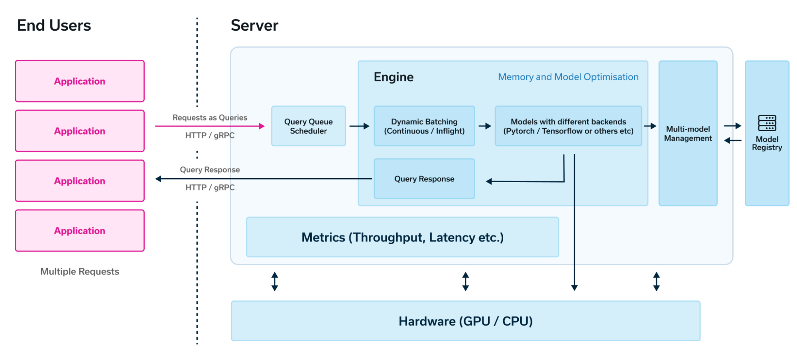

# Large Transformer Model - Inference Optimization

TLDR:

<!-- TOC start (generated with https://github.com/derlin/bitdowntoc) -->

- [Large Transformer Model Inference Overview](#large-transformer-model-inference-overview)
  * [Two-phase process](#two-phase-process)
  * [Challenges of Inferencing Large Transformer Model](#challenges-of-inferencing-large-transformer-model)
- [Algorithmic Optimization](#algorithmic-optimization)
  * [General Methodologies](#general-methodologies)
    + [Quantization](#quantization)
    + [Distillation](#distillation)
    + [Pruning & Sparsity](#pruning--sparsity)
  * [Model Architecture Improvements with Sparsity Considerations](#model-architecture-improvements-with-sparsity-considerations)
    + [MQA and GQA](#mqa-and-gqa)
    + [Mixture of Expert (MOE)](#mixture-of-expert-moe)
- [Implementation / System Optimization](#implementation--system-optimization)
  * [PageAttention](#pageattention)
  * [StreamingLLM](#streamingllm)
  * [FlashAttention](#flashattention)
  * [Speculative Decoding](#speculative-decoding)
- [References](#references)

<!-- TOC end -->

## Large Transformer Model Inference Overview
Most contemporary LLMs are based on the transformer architecture. These models process input text sequentially, token by token. The model generates subsequent tokens until a designated termination token, such as <`end`>, is produced, signaling the completion of the output sequence.

### Two-phase process
LLM inference is generally divided into two primary phases:
* **Prefill Phase** (aka initialization phase): This phase involves processing the entire input sequence and constructing key-value (KV) caches for each decoder layer. Given the availability of all input tokens, this phase is amenable to efficient parallelization, particularly for long input contexts.
* **Decode Phase** (aka generation phase): LLM iteratively generates output tokens, using the previously generated tokens and the KV caches to compute the next token. While the decoding process is sequential, it still involves matrix-vector operations that can be parallelized.

A typical LLM inference server architecture[^ref-llm-arch] is illustrated in Figure 1. It includes:
* **Query Queue Scheduler**: This component manages incoming queries and optimizes batching for efficient inference.
* **Inference Engine**: The inference engine handles dynamic batching and orchestrates the prefill and decode phases. It employs GPUs or other specialized hardware to accelerate computationally intensive operations.

Due to the distinct computational patterns of the prefill and decode phases, they are often optimized separately. This allows for tailored hardware and software optimizations to maximize performance.

   
  Figure 1: Typical Architecture of LLM Inference Servers and Engines

### Challenges of Inferencing Large Transformer Model
There are multiple challenges around LLM inference:
* Heave computation in prefill phase
* Handling super-long context (challenge for both storage and computation, which is quadratic to sequence length)
* Storage of KV cache
* KV Cache management for multiple queries

The sections below will discuss optimizations that mitigate these challenges.

## Algorithmic Optimization
Optimizations that might impact model quality

### General Methodologies

#### Quantization
* Weights-only Quantization vs Activation Quantization
  * Weights Quantization - only optimize for storage, weights are converted back to FP16 at computation time
  * Activation Quantization - quantize to int8, int4, and recently Nvidia hardware had support for [FP8](https://docs.nvidia.com/deeplearning/transformer-engine/user-guide/examples/fp8_primer.html)
* Post-training quantization (PTQ) vs Quantization-aware training (QAT)
  * PTQ
  * QAT

#### Distillation
* Knowledge transfer to a smaller student model
* The key is to have the student model learn from both ground truth labels and the softened softmax output of the teacher model (softmax with a higher temperature)

#### Pruning & Sparsity
* TBD

### Model Architecture Improvements with Sparsity Considerations

#### MQA and GQA
To reduce the KV cache size, the idea is to share the same key and value among all or a group of heads.
* In the scenario of all heads sharing the same key and values, but only using different queries, it's called multi-query attention (MQA).
* research has discovered that MQA is too aggressive and the model performs degrades. A sweet spot is having a group of queries (instead of all) sharing the same key and value, which is a tradeoff between KV cache size optimization and model quality.
  * [Llama-3](https://ai.meta.com/blog/meta-llama-3/) uses GQA.

#### Mixture of Expert (MOE)

## Implementation / System Optimization
### PageAttention
Use a page table to make use of fragmented memory.

### StreamingLLM
To support super-long context, an artificial **attention sink** was used to preserve model quality.

### FlashAttention
It was discovered that the majority of time consumed during the context phase is I/O. FlashAttention uses the idea of tiling and only loads part of the caches when computing attention scores to ensure more computations are conducted in high-speed SRAM and achieve a 4x speedup without impacting model accuracy.

Flash attention is an *exact optimization*, meaning the computation will be the same as the conventional attention. It only optimizes data access patterns (through tiling) to reduce the I/O overhead.

### Speculative Decoding

## References

[^ref-llm-arch]: Ekin Karabulut, Omer Dayan. "[What it means to serve an LLM and which serving technology to choose from](https://www.run.ai/blog/serving-large-language-models)", 2024
