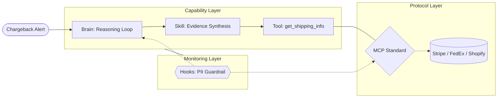

As a Machine Learning Engineer (MLE) transitioning into an **AI-native engineer**, my focus has shifted from a model-centric view to a systems-oriented one. In my MLE days, the core objective was optimizing models to hit business KPIs—carefully balancing precision, recall, and latency to drive specific business outcomes. Today, we are architecting autonomous loops where we ship a "system of intelligence" rather than a static prediction engine.

To build for this era, we must define the structural components that allow an agent to reason and act with enterprise-grade reliability.

---

## 1. The Anatomy: A Layered View

An AI-native system isn't a "mega-prompt." It's an operating system where the model is the CPU, but the value lies in the peripheral and protocol layers.

* **The Brain (Agent):** The core reasoning engine (LLM) utilizing a control loop (e.g., ReAct) to plan and reflect.
* **The Standardized Port (MCP):** The foundational **Protocol Layer**. The Model Context Protocol (MCP) acts as the "USB-C" of the AI world. It defines a universal contract for how agents discover and call capabilities.
* **The Limbs (Tools & Skills):**
    * **Tools:** Built **on top of MCP**. These are the atomic functions (e.g., `get_shipping_info`) that handle the deterministic code required to talk to specific APIs.
    * **Skills:** Expert "recipes" that live in the agent's prompt. A skill bundles tools with instructions on *how* to orchestrate them (the "recipe").
* **The Nervous System (Hooks):** Event-driven interceptors (e.g., `on-error`) that monitor the interaction between the Brain and the MCP Layer.

### **The Intelligence Stack**



---

## 2. The Decision Matrix: MCP vs. Skills

As an engineer, the most important choice you make is where to place your logic. Should it be a high-level instruction in a **Skill** (prompt), or a deterministic function behind an **MCP** port?

| Feature | **Skills (The Prompt)** | **MCP (The Code)** |
| :--- | :--- | :--- |
| **Nature** | Probabilistic & Natural Language | Deterministic & Code-based |
| **Best For** | Strategy, Reasoning, Tone, Nuance | Data Retrieval, Math, API Mutations |
| **Context Load** | **High:** Consumes thousands of tokens | **Low:** Agent only sees the function signature |
| **Reliability** | Variable (Subject to hallucination) | Absolute (Follows hard-coded logic) |
| **Governance** | Difficult to unit test | Easy to test, version, and audit |

#### **Why "Tools-on-MCP" beats "Logic-in-Skills"**
While a Skill (prompt) can technically be shared across agents, using MCP provides two critical advantages:
1.  **Deterministic Reliability:** In a Skill, you might tell an agent: *"If it's Stripe, use field 'id'; if Shopify, use 'order_number'."* An agent might flip these. An **MCP Tool** uses a standard `if/else` block in code, making failure impossible.
2.  **Context Efficiency:** Complex vendor logic can bloat a prompt. By moving that logic to an MCP server, the agent only needs to see: `get_shipping_info(vendor: string)`. This saves the context window for actual reasoning.

---

## 3. Under the Hood: A Concrete Implementation

Let’s look at exactly what is implemented in each layer for a **Chargeback Representment Agent**.

#### **1. In the Tool (The Logic)**
The Tool is the actual code sitting on your server. It handles the "dirty work" of API calls and vendor-specific parsing:
```typescript
// Inside the MCP Server implementation
export async function get_shipping_info(vendor: string, id: string) {
  // Hard-coded, deterministic logic
  if (vendor === 'stripe') return await stripe.charges.retrieve(id);
  if (vendor === 'fedex') return await fedex.track(id);
  if (vendor === 'shopify') return await shopify.order.get(id);
  throw new Error("Unsupported vendor");
}
```

#### **2. In the MCP Protocol (The Bridge)**
MCP doesn't "do" the work; it **announces** it. It translates the agent's high-level intent into that function call. It tells the agent:
> *"I have a tool called `get_shipping_info`. It needs a `vendor` and an `id`. Here is the JSON schema for those parameters."*

#### **3. In the Skill (The Strategy)**
The Skill is the natural language expertise. It defines the workflow:
> *"To win a representment, you must first call `get_shipping_info`. Compare the delivery signature name to the cardholder name. If they match, proceed to generate the rebuttal PDF."*

---

## 4. Summary
AI-native engineering is about placing the right logic in the right layer. We use **Skills** for the expert "why" and **MCP-backed Tools** for the reliable "how." This separation allows us to build agents that are not just smart, but enterprise-ready.
