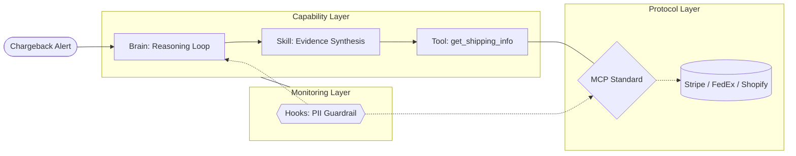

*Estimated read time: 10 minutes*

As a Machine Learning Engineer (MLE) transitioning into an **AI-native engineer**, my focus has shifted from a model-centric view to a systems-oriented one. In my MLE days, the core objective was optimizing models to hit business KPIs—carefully balancing precision, recall, and latency to drive specific business outcomes. Today, we are architecting autonomous loops where the goal is no longer just shipping a static model, but shipping an agent capable of writing code, reviewing designs, and managing domain-specific knowledge bases.

---

## 1. What is AI-Native?

Being "AI-native" means moving beyond treating an LLM as a sophisticated text box. It is an architectural philosophy where the model is the engine, but the system's intelligence is defined by how that engine interacts with its surrounding layers. We are moving from **static automation** to an **evolving architecture**.

### **The Anatomy of an AI-Native System**

To move from static automation to an evolving architecture, we must define the structural components that allow an agent to reason, act, and learn.

* **The Brain (Agent):** The core reasoning engine (LLM) utilizing a control loop to maintain state and plan actions.
* **The Standardized Port (MCP):** The foundational **Protocol Layer**. The Model Context Protocol (MCP) acts as the "USB-C" of the AI world [^mcp_standard], defining a universal contract for how agents discover and call tools. 
* **The Limbs (Tools & Skills):**
    * **Tools:** Built **on top of MCP**. These are atomic functions (e.g., `get_shipping_info`) that handle the deterministic code required to talk to various APIs (Stripe, FedEx, etc.) [^speakeasy_mcp].
    * **Skills:** Expert "recipes" that live in the agent's prompt. A skill bundles tools with instructions on *how* and *when* to use them [^uno_skills].
* **The Nervous System (Hooks):** Event-driven interceptors (e.g., `on-error`) that monitor the interaction between the Brain and the MCP Layer.

---

### **Case Study: The Risk Chargeback Agent**

Consider an agent tasked with **Chargeback Representment**. When a \$500 transaction is disputed, the system doesn't just "chat"—it executes a professional workflow.

* **The Brain** identifies the core need: *"I must verify delivery and match it to transaction metadata to win this dispute."*
* **The Skill** ("Evidence Synthesis") acts as the **Recipe**. It knows the logic: *"First, fetch shipping logs; if the signature is missing, check the GPS delivery coordinates; finally, generate the rebuttal PDF."*
* **The Tool** (`get_shipping_info`) is the **Ingredient**. It is an **MCP-compliant function** that contains the actual code to talk to FedEx or Shopify.
* **The MCP** layer is the **Universal Plug**. It translates the agent's request into the correct API call, allowing that *single* tool to fetch data from Stripe or FedEx interchangeably without the agent needing custom "drivers" for each.
* **The Hooks** are the **Guardrails**. A `pre-submission` hook ensures no PII (like a full credit card number) is leaked in the final rebuttal letter.

---

### **The Decision Matrix: When to Use What?**

Understanding where to place logic is the hallmark of a senior AI-native engineer.

| Feature | **MCP** | **Tools** | **Skills** | **Hooks** |
| :--- | :--- | :--- | :--- | :--- |
| **Layer** | **Protocol** | **Action** | **Orchestration** | **Monitoring** |
| **Analogy** | The USB-C Standard | The Peripheral | The Workflow | The Guardrail |
| **Logic** | Defines *how* to talk. | Defines *what* is done. | Defines *why* and *when*. | Defines *safety*. |

* **Why Tools are on MCP:** By building tools as **MCP-compliant**, you decouple the "doing" from the "reasoning" [^mcp_business]. The agent doesn't need a custom driver for every API; it just needs an MCP client to access your entire library of tools.
* **Skills vs. MCP:** Put the **Protocol** in MCP (e.g., access to GitHub), but put the **Competence** in a Skill (e.g., how to perform a "Squash and Merge" according to your team's style guide).
* **Hooks vs. Tools:** **Tools** are what the agent *does*; **Hooks** are how you *watch* what it does. If the MCP layer returns an error, the Hook catches it to trigger the **Experience-Layer Distillation** loop.

---

## 2. The Evolving Agents: Experience-Layer Distillation (ELD)

The bridge from a static system to an evolving one is **Experience-Layer Distillation (ELD)**. This is the architectural pattern where an agent internalizes "lessons" from its own interaction trajectories, effectively transforming raw test-time execution into persistent system capabilities [^memory_survey]. Unlike weight-based fine-tuning, ELD typically updates the **In-Context Playbook**—a dynamic set of system instructions that governs behavior.

### **Framework and Implementation**

| Implementation | Methodology | Pro | Con |
| :--- | :--- | :--- | :--- |
| **ACE (Playbooks)** [^ace] | Curator-Reflector | Prevents context drift; high logic accuracy. | High token overhead per loop. |
| **Skill Trees** [^agent_ark] | Atomic Distillation | Modular; extremely fast tool execution. | Requires high-quality process data. |
| **RAG-Memory** [^rag_write] | Vectorized Exp | Theoretically infinite long-term memory. | Retrieval noise / "Lost-in-middle". |
| **Distill-to-Weight** [^context_distill] | Online DPO/RLHF | Zero-latency; most stable once trained. | Impossible to "undo" a lesson quickly. |

---

## 3. Industry Adoption: The Three Tiers of Learning

In 2026, agent evolution is managed through a tiered hierarchy to ensure that "lessons learned" are vetted before becoming standards. This grounding ensures the agent reflects on **Explicit Execution Feedback** (e.g., compiler logs, API response codes) rather than just ambiguous chat history.

### **Tier 1: The Individual (Personal Intelligence)**
When you correct a personal agent, it updates your **Personal Intelligence** layer.
* **Mechanism:** It monitors **Implicit User Feedback** and environmental signals.
* **Visibility:** Visible via "Saved Info" settings in consumer tools like Gemini [^google_pi].

### **Tier 2: The Enterprise (Governed Playbooks)**
In the **Gemini Enterprise Agent Platform** (formerly Vertex AI), distilled lessons are stored in **Playbooks**.
* **The \"Needs Your Input\" Pattern:** If an agent identifies a recurring failure, the ELD loop suggests a playbook update in a dedicated **Inbox** [^vertex_playbooks].
* **Visibility:** Playbooks are fully visible as version-controlled markdown or YAML files.
* **Confirmation:** **Explicit Approval Required.** A human engineer must "Commit" the distilled lesson to ensure it meets corporate standards.

### **Tier 3: The Global (Aggregated Improvement)**
Providers aggregate anonymized execution-level feedback across millions of users to improve the **Global Base System Prompts** during scheduled model updates.

---

## 4. Summary

Experience-Layer Distillation is how we move from "One-Shot" assistants to persistent digital colleagues. By building systems that reflect on explicit errors across individual, enterprise, and global tiers, we transform AI into an evolving domain expert. The AI-native engineer no longer just builds the machine; they build the machine that learns how to work.

[^context_distill]: Snell, C., et al. (2024). *Efficient LLM Context Distillation*. arXiv:2409.01930.
[^ace]: Zhang, Q., et al. (2025). *Agentic Context Engineering: Evolving Contexts for Self-Improving Language Models*. arXiv:2510.04618.
[^agent_ark]: Luo, J., et al. (2026). *AgentArk: Distilling Multi-Agent Intelligence into a Single LLM Agent*. arXiv:2602.03955.
[^rag_write]: Lanham, M. (2026). *Knowledge and Memory Beyond RAG: Why 2026 Agents Need a Write Path*. Medium.
[^google_pi]: Google AI Blog (2026). *Personal Intelligence: Connecting Gemini to Google Apps*.
[^vertex_playbooks]: Google Cloud Documentation (2026). *Vertex AI Agent Builder: Playbooks and Governance*.
[^memory_survey]: Wu, W., et al. (2026). *From Storage to Experience: A Survey on the Evolution of LLM Agent Memory Mechanisms*. Preprints 202601.0618.
[^mcp_standard]: NAXIA (2026). *MCP Model Context Protocol for Business | 2026 Guide*.
[^speakeasy_mcp]: Speakeasy (2026). *Skills vs MCP, a false dichotomy*.
[^uno_skills]: Uno Platform (2026). *Introduction to Contextual AI: MCP Tools vs Skills*.
[^mcp_business]: DevStar (2026). *Model Context Protocol (MCP): The Standard Changing AI Integration*.
