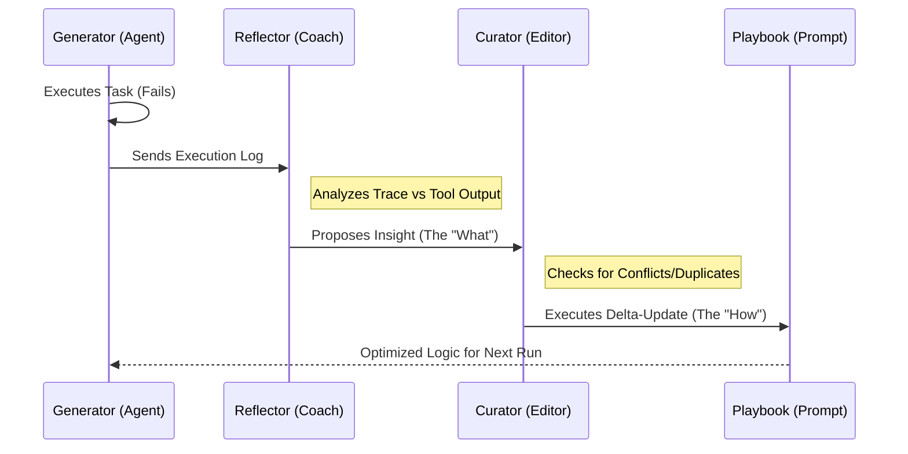

*Estimated read time: 10 minutes*

In an AI-native architecture, shipping is just the beginning. The real goal is to create systems that possess a "write-path"—the ability to learn from execution failures and refine their own behavior without manual code changes. We call this **Experience-Layer Distillation (ELD)** [^eld].

ELD is the architectural shift from *test-time compute* (thinking hard in the moment) to *offline intelligence* (internalizing lessons so they become system instincts).

---

## 1. The ELD Methodology Matrix

The industry has converged on four primary methods to move "experience" into "model capability," each serving a specific engineering constraint.

| Methodology | The Core Idea | Industry Adoption |
| :--- | :--- | :--- |
| **ACE (Context Engineering)** [^ace] | Uses a loop to "write" its own system instructions (Playbooks). | **Google (ADK)** & **ServiceNow**: Deployed for autonomous enterprise operations and IT governance [^google_adk] [^servicenow]. |
| **Skill Trees (AgentArk)** [^agentark] | Distills complex multi-agent debates into a single model's weights. | **ByteDance** & **Alibaba**: Scaling high-concurrency coding and logistics agents in production [^agentark]. |
| **RAG-Memory** [^mem0] | Treats past successes as a vector database for long-term retrieval. | **OpenAI** & **Mem0**: Standard for cross-session personalization in consumer-facing agents. |
| **Distill-to-Weight** [^minillm] | Traditional Knowledge Distillation (KD) from a Teacher to a Student. | **Apple (AFM)** & **Mistral**: Essential for running 7B+ performance on mobile silicon [^apple]. |

### **The "Process Data" Hurdle in Skill Trees**
Why do Skill Trees (**AgentArk**) require high-quality **process data** rather than just outcome data? Traditional distillation only cares if the answer is right. However, to instill a "reflex" of self-correction, an agent needs to see the **process**—the intermediate steps where a model identifies an error and pivots. High-quality process data is the "math scratchpad" of the AI world; without it, the agent learns the answer, but fails to learn the **skill** of reasoning [^agentark].

---

## 2. Deep Dive: ACE (Agentic Context Engineering)

ACE is the most "human-readable" way an agent learns. It doesn't change model weights; it dynamically edits the agent's own manual (the Playbook).

### **How the Reflector Finds Failures**
The Reflector acts as a diagnostic engine analyzing three primary signals:
* **Trace-Signal Mismatch:** Discrepancies between the agent's stated intent and the actual tool output.
* **Repetition Loops:** Identifying when an agent is "stuck" calling the same tool with identical arguments.
* **Negative Feedback Latency:** Treating human "Corrections" as the gold-standard signal of failure.

### **Reflector vs. Curator: The Division of Labor**
To prevent "hallucinated improvements," ACE enforces a strict separation:
1.  **The Reflector (Diagnostic):** Analyzes the trace and **proposes** a specific insight (e.g., *"The database expects ISO-8601 strings"*). It cannot modify the playbook.
2.  **The Curator (Architect):** Receives the proposal and decides **how** to integrate it. It handles deduplication, conflict resolution, and pruning.

### **The Magic of Delta-Updates vs. Context Collapse**
Traditional prompt engineering often uses "Monolithic Rewriting"—asking an LLM to rewrite the entire prompt to be "better." This leads to **Context Collapse**, where the model "forgets" specific edge cases to favor brevity.

ACE uses **Delta-Updates**. The Curator applies narrow, incremental edits (Adding or Modifying specific "bullets" of knowledge). This allows the context to grow organically while preserving critical safety and logic rules that would otherwise be lost in a total rewrite.

---

## 3. Governance: The Three Tiers of Learning

We manage this evolution through a tiered hierarchy to ensure accuracy and safety.

* **Tier 1: Individual (Personal Intelligence):** Implicit learning from user signals (e.g., "Always use metric units") [^mem0].
* **Tier 2: Enterprise (Governed Playbooks):** ACE suggests a playbook update; a human engineer must "Commit" the distilled lesson in platforms like **Vertex AI** [^google_adk].
* **Tier 3: Global (Aggregated Improvement):** Providers aggregate anonymized feedback across millions of users to improve base system prompts during major model updates.

---

## 4. References & Further Reading

These foundational frameworks define the 2026 state-of-the-art for Experience-Layer Distillation:

* **ELD Framework:** *"Get Experience from Practice: LLM Agents with Record & Replay"* (arXiv:2505.17716). [^eld]
* **ACE (Agentic Context Engineering):** Zhang, Q., et al. (2025). *"Evolving Contexts for Self-Improving Language Models"* (arXiv:2510.04618). [^ace]
* **AgentArk (Skill Trees):** Luo, Y., et al. (2026). *"Distilling Multi-Agent Intelligence into a Single LLM Agent"* (arXiv:2602.03955). [^agentark]
* **RAG-Memory:** *"Mem0: Universal memory layer for AI Agents"* (arXiv:2504.19413). [^mem0]
* **Distill-to-Weight:** *"MiniLLM: Knowledge Distillation of Large Language Models"* (arXiv:2306.08543). [^minillm]
* **Apple Intelligence Foundation Models:** *"AFM-on-device Knowledge Distillation"* (arXiv:2407.21075). [^apple]

[^eld]: Feng, E., et al. (2025). *"Get Experience from Practice: LLM Agents with Record & Replay."* arXiv:2505.17716.
[^ace]: Zhang, Q., et al. (2025). *"Agentic Context Engineering: Evolving Contexts for Self-Improving Language Models."* arXiv:2510.04618.
[^agentark]: Luo, Y., et al. (2026). *"AgentArk: Distilling Multi-Agent Intelligence into a Single LLM Agent."* arXiv:2602.03955.
[^mem0]: Chhikara, P., et al. (2025). *"Mem0: Building Production-Ready AI Agents with Scalable Long-Term Memory."* ECAI 2025.
[^minillm]: Gu, Y., et al. (2023). *"MiniLLM: Knowledge Distillation of Large Language Models."* arXiv:2306.08543.
[^apple]: Gunter, T., et al. (2024). *"Apple Intelligence Foundation Language Models."* arXiv:2407.21075.
[^google_adk]: Google Cloud (2025). *"Vertex AI Agent Builder Playbooks: Architecting Context-Aware Frameworks."*
[^servicenow]: ServiceNow (2026). *"Autonomous Enterprise Operations: Scaling Agentic Workflows."*

---

## Summary
The "Smart" agent of 2026 isn't just the one with the most parameters; it's the one with the most efficient **Experience-Layer Distillation** loop. By moving from **ACE** for strategy to **AgentArk** for speed, we are building systems that don't just follow instructions—they learn how to write them.
