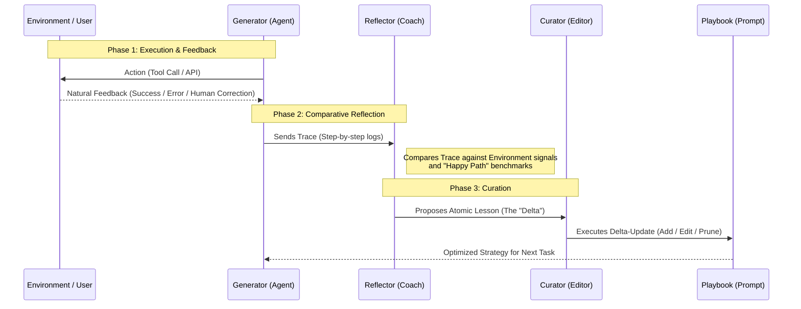

*Estimated read time: 10 minutes*

In an AI-native architecture, shipping is just the beginning. The real goal is to create systems that possess a "write-path"—the ability to learn from execution failures and refine their own behavior without manual code changes. We call this **Experience-Layer Distillation (ELD)** [^eld].

ELD is the architectural shift from *test-time compute* (thinking hard in the moment) to *offline intelligence* (internalizing lessons so they become system instincts).

---

## 1. The ELD Methodology Matrix

The industry has converged on four primary methods to move "experience" into "model capability," each serving a specific engineering constraint.

| Methodology | The Core Idea | Industry Adoption |
| :--- | :--- | :--- |
| **ACE (Context Engineering)** [^ace] | Uses a loop to "write" its own system instructions (Playbooks). | **Google (ADK)** & **ServiceNow**: Deployed for autonomous enterprise operations and IT governance [^google_adk] [^servicenow]. |
| **Skill Trees (AgentArk)** [^agentark] | Distills complex multi-agent debates into a single model's weights. | **ByteDance** & **Alibaba**: Scaling high-concurrency coding and logistics agents in production [^agentark]. |
| **RAG-Memory** [^mem0] | Treats past successes as a vector database for long-term retrieval. | **OpenAI** & **Mem0**: Standard for cross-session personalization in consumer-facing agents. |
| **Distill-to-Weight** [^minillm] | Traditional Knowledge Distillation (KD) from a Teacher to a Student. | **Apple (AFM)** & **Mistral**: Essential for running 7B+ performance on mobile silicon [^apple]. |

### **The "Process Data" Hurdle in Skill Trees**
Why do Skill Trees (**AgentArk**) require high-quality **process data** rather than just outcome data? Traditional distillation only cares if the answer is right. However, to instill a "reflex" of self-correction, an agent needs to see the **process**—the intermediate steps where a model identifies an error and pivots. High-quality process data is the "math scratchpad" of the AI world; without it, the agent learns the answer, but fails to learn the **skill** of reasoning [^agentark].

---

## 2. Deep Dive: ACE (Agentic Context Engineering)

ACE is the most "human-readable" way an agent learns. It doesn't change model weights; it dynamically edits the agent's own manual (the Playbook). 

### **The Architecture: Multi-Source & Comparative Reflection**
The ACE framework operates as a closed-loop system where three distinct roles collaborate to distill experience into instruction. In production, this isn't a linear chain; it is a **contrastive analysis** where the system compares its internal intent against external reality.

1.  **The Generator:** The primary agent that interacts with tools and users.
2.  **The Reflector:** An offline diagnostic agent that compares execution traces against signals from the **Environment** (API errors, unit tests) or the **User** (corrections).
3.  **The Curator:** The "editor-in-chief" that manages the structural integrity of the Playbook using precise delta-updates.

### **How the Reflector Finds Failures**
The Reflector acts as a diagnostic engine analyzing three primary signals:
* **Trace-Signal Mismatch:** Discrepancies between the agent's stated intent ("I will call X") and the actual environment output ("Error: Y").
* **Repetition Loops:** Identifying when an agent is "stuck" calling the same tool with identical arguments.
* **Negative Feedback Latency:** Treating human "Corrections" as the gold-standard signal of failure.

### **The Role of the Curator: Beyond Simple Updates**
While the Reflector finds the "What," the Curator determines the "How." Its job is to maintain a high "Signal-to-Noise" ratio in the prompt through four specific operations:
* **Add:** Creating a new "bullet point" for an entirely new edge case.
* **Refine/Edit:** Updating an existing rule that was too vague or slightly incorrect based on new evidence.
* **Consolidate:** Merging similar rules into one generalized principle to save tokens and reduce complexity.
* **Prune:** Removing outdated rules or those superseded by more robust model capabilities.

### **The Magic of Delta-Updates vs. Context Collapse**
Traditional prompt engineering often uses "Monolithic Rewriting"—asking an LLM to rewrite the entire prompt. This leads to **Context Collapse**, where the model "forgets" specific edge cases to favor brevity. ACE uses **Delta-Updates**—narrow, incremental edits—to preserve critical safety and logic rules that would otherwise be lost.

---

## 3. Governance: When is a Human Required?

We do not want agents learning "bad habits" autonomously. The industry has converged on a **Risk-Based Autonomy** model [^auxilio] [^mindstudio], where the decision to ask for human confirmation (Human-in-the-Loop) is governed by specific tiers:

| Scenario | Mode | Logic & Reference |
| :--- | :--- | :--- |
| **Personal Preferences** | **Autonomous** | Implicit learning from user signals (e.g., "Always use metric"). [^mem0] |
| **Tactical Corrections** | **Autonomous** | Fixes for tool errors (e.g., date formats) if Reflector confidence >95%. [^eledath] |
| **Strategic Logic** | **HITL Required** | Updates changing business processes (e.g., pricing strategy) require MLE review. [^google_adk] |
| **Safety & Compliance** | **HITL Required** | Any update affecting PII handling or regulatory logic triggers an audit event. [^servicenow] |

---

## Summary
The "Smart" agent of 2026 isn't just the one with the most parameters; it's the one with the most efficient **Experience-Layer Distillation** loop. By moving from **ACE** for strategy to **AgentArk** for speed, we are building systems that don't just follow instructions—they learn how to write them.

[^eld]: Feng, E., et al. (2025). [**"Get Experience from Practice: LLM Agents with Record & Replay."**](https://arxiv.org/abs/2505.17716) arXiv:2505.17716.
[^ace]: Zhang, Q., et al. (2025). [**"Agentic Context Engineering: Evolving Contexts for Self-Improving Language Models."**](https://arxiv.org/abs/2510.04618) arXiv:2510.04618.
[^agentark]: Luo, Y., et al. (2026). [**"AgentArk: Distilling Multi-Agent Intelligence into a Single LLM Agent."**](https://arxiv.org/abs/2602.03955) arXiv:2602.03955.
[^mem0]: Tulsyan, A., et al. (2025). [**"Mem0: Universal memory layer for AI Agents."**](https://github.com/mem0ai/mem0) GitHub mem0ai/mem0.
[^minillm]: Gu, Y., et al. (2023). [**"MiniLLM: Knowledge Distillation of Large Language Models."**](https://arxiv.org/abs/2306.08543) arXiv:2306.08543.
[^apple]: Gunter, T., et al. (2024). [**"Apple Intelligence Foundation Language Models."**](https://arxiv.org/abs/2407.21075) arXiv:2407.21075.
[^google_adk]: Google Cloud (2025). [**"Playbook best practices for AI Generators."**](https://docs.cloud.google.com/dialogflow/cx/docs/concept/playbook/best-practices) Google Cloud Documentation.
[^servicenow]: ServiceNow (2026). [**"Establishing Governance and Human Oversight in Agentic Workflows."**](https://www.servicenow.com/company/media/press-room/ai-agents-google-cloud.html) ServiceNow News.
[^auxilio]: Webelight Solutions (2025). [**"How to Choose Between Autonomous and Human-in-the-Loop Agents."**](https://www.auxiliobits.com/blog/how-to-choose-between-autonomous-and-human-in-the-loop-agents/) Auxiliobits.
[^mindstudio]: MindStudio (2026). [**"The Best Open-Source LLMs for Agentic Coding in 2026."**](https://www.mindstudio.ai/blog/best-open-source-llms-agentic-coding-2026) MindStudio Blog.
[^eledath]: Eledath, B. (2026). [**"The 8 Levels of Agentic Engineering."**](https://www.bassimeledath.com/blog/levels-of-agentic-engineering) Bassim Eledath Blog.
