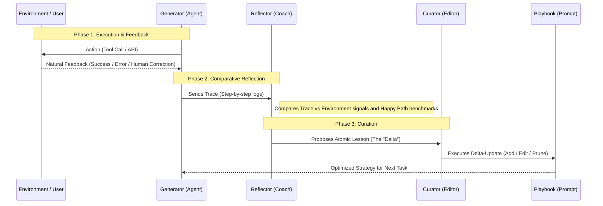

In an AI-native architecture, shipping is just the beginning. The real goal is to create systems that possess a "write-path"—the ability to learn from execution failures and refine their own behavior without manual code changes. We call this **Experience-Layer Learning (ELL)** [^eld].

Without a write-path, every agent error is a manual ticket: an engineer debugs the trace, rewrites the prompt, and redeploys. With ELL, the agent writes that ticket itself.

ELL is the architectural shift from *test-time compute* (thinking hard in the moment) to *offline intelligence* (internalizing lessons so they become system instincts).

---

## 1. The ELL Methodology Matrix

The industry has converged on five primary methods to move "experience" into "model capability," each serving a specific engineering constraint.

| Methodology | The Core Idea | Adoption & Results |
| :--- | :--- | :--- |
| **ACE (Context Engineering)** [^ace] | Uses a closed loop to "write" its own system instructions (Playbooks). No weight updates required. | **Google (ADK)** & **ServiceNow** in production [^google_adk] [^servicenow]. +10.6% on AppWorld; −87% adaptation latency [^ace]. |
| **CER (Contextual Experience Replay)** [^cer] | Synthesizes past trajectories into a dynamic in-context memory buffer; retrieved at inference time. Training-free. | Research-stage (ACL 2025). SOTA on WebArena (36.7%) and VisualWebArena (31.9%); no documented production deployments yet [^cer]. |
| **ERL (Experiential Reflective Learning)** [^erl] | Builds a reusable pool of heuristics by reflecting on failure trajectories; injects relevant ones at test time. | Research-stage (2026 preprint). +7.8% on Gaia2 over ReAct; no documented production deployments yet [^erl]. |
| **Skill Trees (AgentArk)** [^agentark] | Distills complex multi-agent reasoning into a single model's weights via process data. | **ByteDance** & **Alibaba** in production [^agentark]. High-concurrency coding and logistics agents. |
| **Memory Layer (Episodic + Semantic)** [^mem0] | Persists structured knowledge across sessions — raw trajectories (episodic) plus distilled facts (semantic). | **OpenAI** & **Mem0** in production. Standard architecture for cross-session personalization. |

> **Note:** Traditional Knowledge Distillation (Teacher → Student KD) is sometimes listed here, but it is a training-time technique rather than a runtime experience loop — see the [Knowledge Distillation deep-dive](/2026/04/10/knowledge-distillation-dd.html) for a full treatment.

### Untangling the Runtime Methods: ACE vs. CER vs. ERL vs. Memory Layer

ACE, CER, ERL, and the Memory Layer all operate at runtime without touching model weights — so what actually separates them? The distinction is *where* each method writes its knowledge and *how durable* that write is.

* **Memory Layer** is the most passive. It records what happened (episodic) and what is known to be true (semantic), and surfaces that information on request. It doesn't change how the agent reasons — it expands what the agent can look up. Think of it as a long-term diary the agent can search.
* **CER** is a step more opinionated. Rather than storing raw history, it synthesizes past trajectories into patterns and injects the most relevant ones into the context window at inference time. It tells the agent: *"here's how similar situations played out"* — but it's still a retrieval operation, not a behavioral change.
* **ERL** goes further still: it reflects specifically on *failures* and extracts heuristics — *"don't do X in situation Y."* These heuristics are reusable across tasks, but like CER, they're injected at inference time and don't affect the agent's baseline behavior between runs.
* **ACE** is the only method that permanently changes the agent's instructions. The Curator rewrites the Playbook — the agent's system prompt — so every future run starts from an improved baseline. It's not augmenting the context window; it's raising the floor.

The progression is: **passive retrieval → experience injection → instruction rewriting**. Each step makes the improvement more durable: the Memory Layer helps the agent remember; CER and ERL help the agent adapt; ACE helps the agent *become better*.

### Skill Trees: The Process Data Hurdle
Why do Skill Trees (**AgentArk**) require high-quality **process data** rather than just outcome data? Traditional distillation only cares if the answer is right. But to instill a "reflex" of self-correction, an agent needs to see the **process**—the intermediate steps where a model identifies an error and pivots. Process data is the "math scratchpad" of the AI world; without it, the agent learns the answer but fails to internalize the **skill** of reasoning [^agentark].

### Memory Layer: Beyond a Simple Vector Store
Calling the memory layer "a vector database for past successes" understates both its power and its limits. Pure retrieval-augmented memory has three structural gaps: it can't update state (only append), it retrieves by embedding similarity rather than truth, and it has no sense of time. The 2026 production pattern separates two distinct concerns:
* **Episodic memory:** Full trajectories, timestamped, preserving narrative flow — *what happened and in what order.*
* **Semantic memory:** Distilled facts, preferences, and rules — *what the agent has learned to be true.*

Systems like Mem0 manage this split, but the engineering overhead is non-trivial. For agents that operate across long horizons, this architecture is unavoidable.

---

## 2. Deep Dive: ACE (Agentic Context Engineering)

Of the five methods above, **ACE earns a dedicated deep dive.** It is the only approach that requires no weight updates, no curated training data, and no retraining — making it deployable as a pure system change in a production environment. It also directly solves the failure mode that quietly kills long-lived agents: **context collapse**, where iterative prompt rewrites erode critical edge-case rules over time.

On the AppWorld benchmark, ACE outperforms prior methods (Dynamic Cheatsheet, GEPA) by +10.6% and matches the top-ranked production agent using a smaller open-source model — while cutting adaptation latency by up to 87% [^ace].

ACE is the most "human-readable" way an agent learns: it doesn't change model weights; it dynamically edits the agent's own manual (the **Playbook**).

### The Architecture: Multi-Source & Comparative Reflection
The ACE framework operates as a closed-loop system where three distinct roles collaborate to translate experience into instruction. In production, this isn't a linear chain; it is a **contrastive analysis** where the system compares its internal intent against external reality.

1. **The Generator:** The primary agent that interacts with tools and users.
2. **The Reflector:** An offline diagnostic agent that compares execution traces against signals from the **Environment** (API errors, unit tests) or the **User** (corrections).
3. **The Curator:** The "editor-in-chief" that manages the structural integrity of the Playbook using precise delta-updates.

### How the Reflector Finds Failures
The Reflector acts as a diagnostic engine analyzing three primary signals:
* **Trace-Signal Mismatch:** Discrepancies between the agent's stated intent ("I will call X") and the actual environment output ("Error: Y").
* **Repetition Loops:** Identifying when an agent is "stuck" calling the same tool with identical arguments.
* **Negative Feedback Latency:** Treating human "Corrections" as the gold-standard signal of failure.

### The Magic of Delta-Updates vs. Context Collapse
Traditional prompt engineering often uses "Monolithic Rewriting" — asking an LLM to rewrite the entire prompt. This leads to **Context Collapse**, where the model "forgets" specific edge cases to favor brevity. ACE uses **Delta-Updates** — narrow, incremental edits — to preserve critical safety and logic rules that would otherwise be lost. The Curator executes four targeted operations: adding rules for new edge cases, refining rules that were too vague, consolidating overlapping rules into generalized principles, and pruning rules made obsolete by model improvements.

### Head-to-Head: ACE vs. CER and ERL
CER and ERL are strong challengers, but they operate in a different regime. CER achieves SOTA on web navigation by synthesizing past trajectories in-context [^cer]; ERL builds failure-derived heuristics that prune bad strategies at test time [^erl]. Both are effective for their target domains. The key differentiator for ACE is durability: neither CER nor ERL modify the agent's baseline — their improvements exist only within a single inference context. ACE's Curator permanently updates the Playbook, so every future run inherits the lesson. For long-lived production agents that need to get reliably better over weeks and months, that persistence is the deciding factor.

---

## 3. Governance: When is a Human Required?

We do not want agents learning "bad habits" autonomously. The industry has converged on a **Risk-Based Autonomy** model [^auxilio] [^mindstudio], where the decision to ask for human confirmation (Human-in-the-Loop) is governed by specific tiers:

| Scenario | Mode | Logic & Reference |
| :--- | :--- | :--- |
| **Personal Preferences** | **Autonomous** | Implicit learning from user signals (e.g., "Always use metric"). [^mem0] |
| **Tactical Corrections** | **Autonomous** | Fixes for tool errors (e.g., date formats) if Reflector confidence >95%. [^eledath] |
| **Strategic Logic** | **HITL Required** | Updates changing business processes (e.g., pricing strategy) require MLE review. [^google_adk] |
| **Safety & Compliance** | **HITL Required** | Any update affecting PII handling or regulatory logic triggers an audit event. [^servicenow] |

---

## Summary
The "Smart" agent of 2026 isn't just the one with the most parameters; it's the one with the most efficient **Experience-Layer Learning** loop. In a production pipeline, these methodologies are increasingly sequential: engineers use **ACE** to iteratively discover and refine strategic instructions in a human-readable "Playbook," and then leverage **AgentArk** to "bake" that multi-agent intelligence into high-performance, single-model weights for deployment at scale.

---

[^eld]: Feng, E., et al. (2025). [**"Get Experience from Practice: LLM Agents with Record & Replay."**](https://arxiv.org/abs/2505.17716) arXiv:2505.17716.
[^ace]: Zhang, Q., et al. (2025). [**"Agentic Context Engineering: Evolving Contexts for Self-Improving Language Models."**](https://arxiv.org/abs/2510.04618) arXiv:2510.04618. Stanford / SambaNova / UC Berkeley.
[^agentark]: Luo, Y., et al. (2026). [**"AgentArk: Distilling Multi-Agent Intelligence into a Single LLM Agent."**](https://arxiv.org/abs/2602.03955) arXiv:2602.03955.
[^mem0]: Tulsyan, A., et al. (2025). [**"Mem0: Universal memory layer for AI Agents."**](https://github.com/mem0ai/mem0) GitHub mem0ai/mem0.
[^google_adk]: Google Cloud (2025). [**"Playbook best practices for AI Generators."**](https://docs.cloud.google.com/dialogflow/cx/docs/concept/playbook/best-practices) Google Cloud Documentation.
[^servicenow]: ServiceNow (2026). [**"Establishing Governance and Human Oversight in Agentic Workflows."**](https://www.servicenow.com/company/media/press-room/ai-agents-google-cloud.html) ServiceNow News.
[^auxilio]: Webelight Solutions (2025). [**"How to Choose Between Autonomous and Human-in-the-Loop Agents."**](https://www.auxiliobits.com/blog/how-to-choose-between-autonomous-and-human-in-the-loop-agents/) Auxiliobits.
[^mindstudio]: MindStudio (2026). [**"The Best Open-Source LLMs for Agentic Coding in 2026."**](https://www.mindstudio.ai/blog/best-open-source-llms-agentic-coding-2026) MindStudio Blog.
[^eledath]: Eledath, B. (2026). [**"The 8 Levels of Agentic Engineering."**](https://www.bassimeledath.com/blog/levels-of-agentic-engineering) Bassim Eledath Blog.
[^cer]: Liu, Y., et al. (2025). [**"Contextual Experience Replay for Self-Improvement of Language Agents."**](https://aclanthology.org/2025.acl-long.694/) ACL 2025.
[^erl]: Zhao, R., et al. (2026). [**"Experiential Reflective Learning for Self-Improving LLM Agents."**](https://arxiv.org/abs/2603.24639) arXiv:2603.24639.
